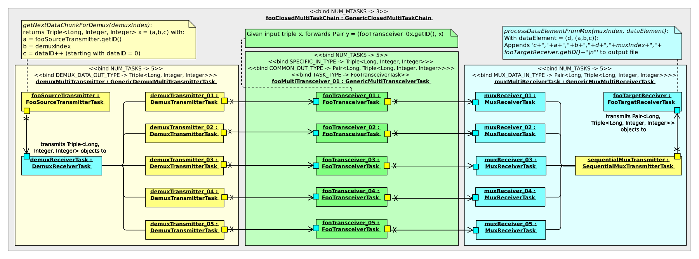
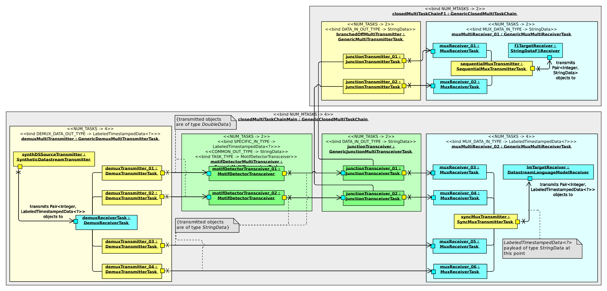
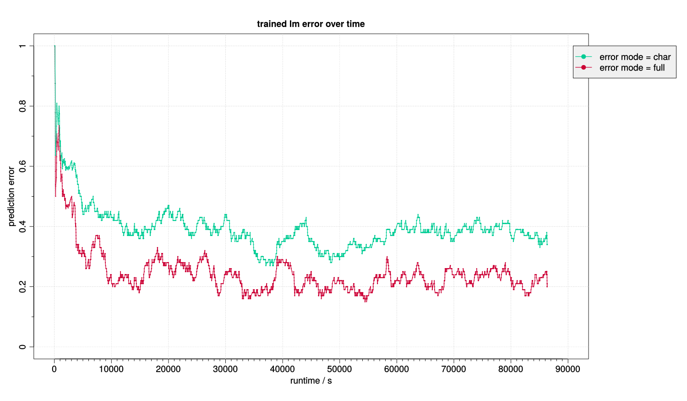

# Transceiver Framework and MDP: A Motif Detector and Predictor
The **Transceiver Framework** project provides a JAVA infrastructure for parallel, multistage processing of data and data streams in particular. The **MDP** is a concrete transceiver framework application for the detection and prediction of motifs and labels based on multivariate, heterogeneous data streams.

## Transceiver Framework


### Introduction
The **Transceiver Framework** has the following characteristics:

* It provides a simple JAVA API for:
    * Defining the data processing infrastructure (order of data processing steps, forks and joins of intermediate processed streams, etc.).
    * Plugging in custom methods for each data processing step.
* It has a high level of concurrency and scalability.
* The user can focus (almost) completely on the implementation of his or her data processing methods without having to worry about the technical infrastructure, concurrency issues, etc.

More detailed information about the **Transceiver Framwork**'s structure and inner workings can be found in [`./doc/doc.pdf`](./doc/doc.pdf) file.

### Prerequisites
* JAVA version >= 1.8, we tested it with OpenJDK (version 1.8.0_191)
* The transceiver framework itself is implemented in a platform independent manner.
* In case you want to use the Shell scripts mentioned in the next section, you require:
    * A Unix-Shell like Bash. Linux systems typically come with a pre-installed Shell. On Windows, you might want to try an environment like [Cygwin](https://cygwin.com/) (this *might* work, but we did not test it).
    * Maven (tested with version 3.3.9) for project compilation and jar creation based on the `pom.xml` files.

### Installation & example run
Note: `.` represents this repository's root directory.

1. Clone this repository and its submodules (if present) to your local hard drive via:  
    * Either: Console command: 
        ```bash
            git clone --recurse-submodules https://github.com/GStepien/Transceiver_Framework.git &&
                cd Transceiver_Framework &&
                git fetch --tags && 
                git merge FETCH_HEAD &&
                cd ..
        ```
    * Or: Download the Shell script [`./git_clone_recursive.sh`](./git_clone_recursive.sh) from [here](https://raw.githubusercontent.com/GStepien/Transceiver_Framework/master/git_clone_recursive.sh), make it executable via `chmod u+x ./git_clone_recursive.sh` and execute it. The script clones this repository into the directory from which it is executed.
2. Fetching later updates (including updates of potential submodules):  
    * Either: Console command: 
        ```bash
            git fetch && git fetch --tags && git merge FETCH_HEAD &&
                git submodule update --init --recursive &&
                git submodule update --recursive
        ```
    * Or: Execute the Shell script [`./git_pull_recursive.sh`](./git_pull_recursive.sh)
3. Example run:
    * Execute the Shell script [`./examples/transceiver_framework/muxdemux/execute.sh`](./examples/transceiver_framework/muxdemux/execute.sh). This triggers the following actions:
        1. If no `./transceiver_framework/transceiver_framework/transceiver_framework.jar` file exists yet, the script executes the command: `./install.sh "./transceiver_framework/pom.xml"` which:
            1. Pulls the newest code version.
            2. Executes `mvn clean -f <provided_path_to_pom.xml>`.
            3. Executes `mvn install -f <provided_path_to_pom.xml>`.
                * The latter installs the transceiver framework into the local maven repository and creates a jar with the aforementioned name and location. Apart from the compiled code, the jar file also contains all required dependencies.
        2. Executes a transceiver framework run based on the configuration in [`./examples/transceiver_framework/muxdemux/config/`](./examples/transceiver_framework/muxdemux/config/). The structure of this particular framework configuration is depicted in the figure above.
        3. The duration of the execution is limited by the "run_for" field in [`./examples/transceiver_framework/muxdemux/config/root_config.json`](./examples/transceiver_framework/muxdemux/config/root_config.json), which is set to 60000 milliseconds (1 minute) here.

We highly recommend to study the code in `./examples/transceiver_framework/muxdemux/execute.sh` and [`./transceiver_framework/transceiver_framework.sh`](./transceiver_framework/transceiver_framework.sh) which, along with the configuration files in [`./examples/transceiver_framework/muxdemux/`](./examples/transceiver_framework/muxdemux/), [`./examples/transceiver_framework/muxdemux/config/`](./examples/transceiver_framework/muxdemux/config/) and the code in [`./transceiver_framework/transceiver_framework/src/main/java/gs/examples/tf/muxdemux/`](./transceiver_framework/transceiver_framework/src/main/java/gs/examples/tf/muxdemux/), serve as a usage template.

### Version
Release versions correspond to commits to the `master` branch with a commit tag `<version>-TF-RELEASE`. Checkout this version via `git checkout <version>-TF-RELEASE`.

The current release version is: `1.0.0`.

### License
See [`./LICENSE.md`](./LICENSE.md).

## MDP: A Motif Detector and Predictor


### Introduction
The **MDP** is a data analysis tool build upon the transceiver framework. It performs the following tasks:

1. It receives a number of numeric and string label data streams as input and transforms each numeric stream into a string label stream. For each numeric input stream, said transformation is performed as follows:
    * MDP continuously searches for motifs (i.e., repeating subsequences) in that numeric stream and transforms it into a string stream by replacing each numeric value with a string label indicating whether the corresponding value was classified as being part of a motif and or not.
2. MDP forwards the input string label streams as well as the string label streams resulting from the transformations to a language model trainer. The latter continuously trains and evaluates a language model based on the input data and the motif ground truth.

The input data streams are generated by an instance of our [**Synthetic Datastream Generator (SGD)**](https://github.com/GStepien/SDG) (which also annotates the numeric data with the required motif ground truth). The latter is already included as a Git submodule in this repository's [`./mdp/mdp/submodules/`](./mdp/mdp/submodules/) folder. The structure of MDP as a concrete transceiver framework instance is depicted in the figure above.

### Prerequisites
In addition to the requirements from the "Transceiver Framework" section, MDP requires:

* For the SGD: 
    * Installed R (https://www.r-project.org/), we tested MDP with R version 3.4.4.
    * A Unix system: For the communication between the MDP (which is implements in JAVA) and the SDG (which is implemented in R), we use [Rserve](https://www.rforge.net/Rserve/) 1.7-3. According to their Website, multiple connections to a single Rserve Server instance are currently (as of December 2018) only supported on Unix Systems. We ran our tests under Ubuntu 16.04 LTS and 18.04 LTS (both 64 bit).
* Cores cores cores, the more the better ...

### Installation & example run
Note: `.` represents this repository's root directory.

1. Clone this repository to your local hard drive just as described above (the MDP project currently resides in the same Git repository as the transceiver framework - this will probably change in the future).
2. Fetching later updates: Again, see above.
3. Example run:
    * Execute the Shell script [`./examples/mdp/01/execute.sh`](./examples/mdp/01/execute.sh). This triggers the following actions:
        1. If no `./mdp/mdp/mdp.jar` file exists yet, the script executes the command: `./install.sh "./mdp/pom.xml"` The latter:
            1. Pulls the newest code version.
            2. Executes `mvn clean -f <provided_path_to_pom.xml>`.
            3. Executes `mvn install -f <provided_path_to_pom.xml>`.
                * The latter installs the MDP into the local maven repository and creates a jar with the aforementioned name and location. Apart from the compiled code, the jar file also contains all required dependencies (including those from the transceiver framework).
        2. Executes a MDP run based on the configuration in [`./examples/mdp/01/config/`](./examples/mdp/01/config/). The (simplified) structure of the MDP in its role as a particular transceiver framework configuration is depicted in the figure above.
        3. The duration of the execution is limited by the "run_for" field in [`./examples/mdp/01/config/root_config.json`](./examples/mdp/01/config/root_config.json), which is set to 1800000 milliseconds (30 minutes) here.
        4. MDP creates a number of statistics in a newly created `./examples/mdp/01/stats/` folder. After the execution has finished, the script executes the R-script [`./examples/mdp/01/evaluate.R`](./examples/mdp/01/evaluate.R) which, based on the previously generated statistics, creates a number of graphs in a newly created `./examples/mdp/01/graphs/` folder.

The folder `./examples/mdp/01-24h_run/` contains the configuration and statistics of a 24 hour MDP run. Apart from the longer runtime, it is configured just like the example from `./examples/mdp/01/` (in particular, SDG is configured to generate the same data). The figure below contains this run's prediction error over time:

The prediction error at each point refers to the average error over the last 100 predictions. The error modes are:

* "full": Refers to the average prediction error over all dimensions.
* "char": Refers to the average prediction error when only considering dimensions corresponding to string label input streams.

We highly recommend to study the code in `./examples/mdp/01/execute.sh` and [`./mdp/mdp.sh`](./mdp/mdp.sh) which, along with the configuration files in [`./examples/mdp/01/`](./examples/mdp/01/), [`./examples/mdp/01/config/`](./examples/mdp/01/config/) and the code in [`./mdp/mdp/src/`](./mdp/mdp/src/), serve as a usage template.

### Version
Release versions correspond to commits to the `master` branch with a commit tag `<version>-MDP-RELEASE`. Checkout this version via `git checkout <version>-MDP-RELEASE`.

The current release version is: `1.0.0`.

### License
See [`./LICENSE.md`](./LICENSE.md).

Copyright (c) 2018 Grzegorz Stepien
